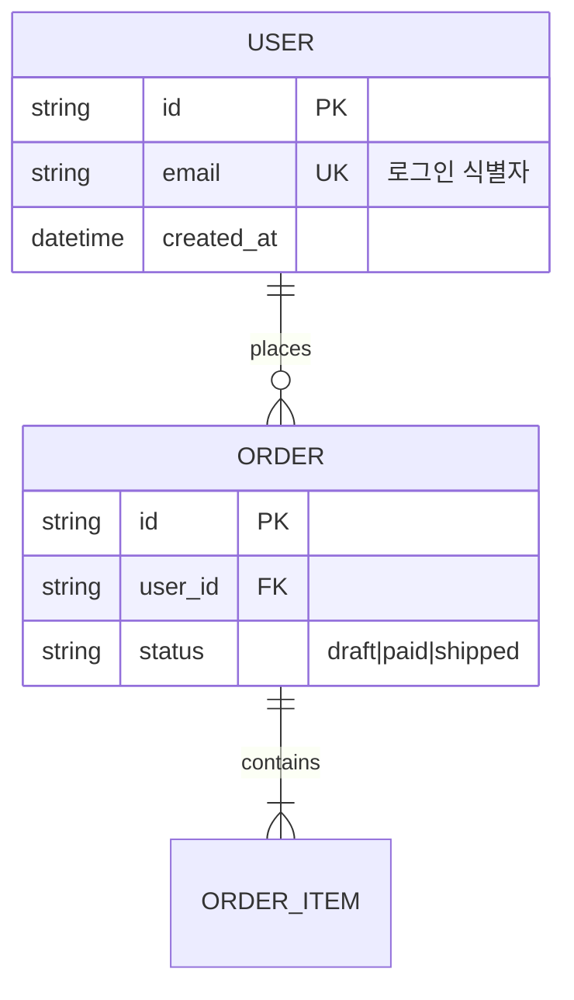

# <이름> — 데이터 모델 (ERD)

> 표기: Mermaid `erDiagram` (Crow's Foot). GitHub에서 바로 렌더되고 텍스트라 diff 리뷰 가능.
> `source_of_truth`가 코드 스키마면 이 문서는 **도출물** — 스키마 변경 시 이 문서를 재생성한다(수기 드리프트 금지).

## ERD

<!-- 위는 예시 — 실제 엔티티로 교체. 카디널리티: ||=정확히1, o|=0또는1, }|=1이상, }o=0이상 -->

## 엔티티 노트
<!-- 엔티티마다 "왜 존재하나" 1줄. 비자명한 관계·제약은 근거 1줄. -->
| 엔티티 | 왜 존재하나 | 비고(제약·인덱스·수명) |
|---|---|---|
| | | |

## 마이그레이션·수명 메모 (해당 시)
<!-- 소프트삭제? 보존기간? 개인정보 필드? 이 표가 비어 있으면 "없음"이라고 쓴다. -->
-
